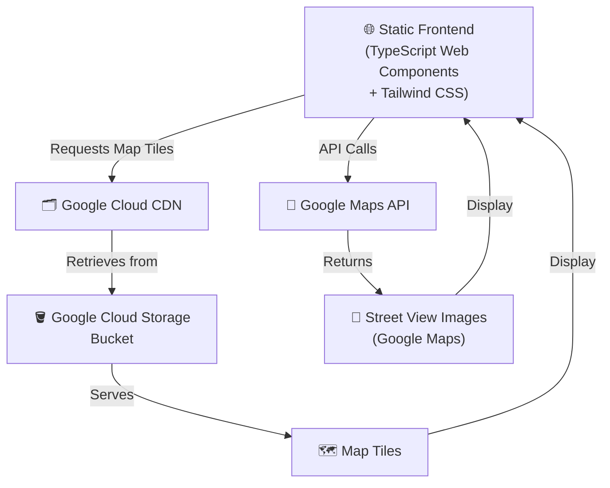
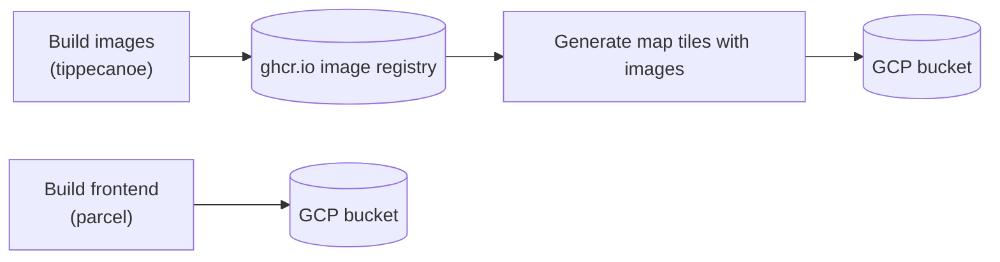

```mermaid
graph TB
    FrontEnd["🌐 Static Frontend<br/>(TypeScript Web Components<br/>+ Tailwind CSS)"]
    GMapsAPI["📍 Google Maps API"]
    CDN["🗂️ Google Cloud CDN"]
    Bucket["🪣 Google Cloud Storage<br/>Bucket"]
    StreetView["📸 Street View Images<br/>(Google Maps)"]
    MapTiles["🗺️ Map Tiles"]
    
    FrontEnd -->|Requests Map Tiles| CDN
    CDN -->|Retrieves from| Bucket
    Bucket -->|Serves| MapTiles
    MapTiles -->|Display| FrontEnd
    FrontEnd -->|API Calls| GMapsAPI
    GMapsAPI -->|Returns| StreetView
    StreetView -->|Display| FrontEnd
```

## Build

```mermaid
flowchart LR
    A["Build images<br/>(tippecanoe)"] --> B[("ghcr.io image registry")]
    C["Build frontend<br/>(parcel)"] --> D[("GCP bucket")]
    B --> E["Generate map tiles with images"]
    E --> F[("GCP bucket")]
```

