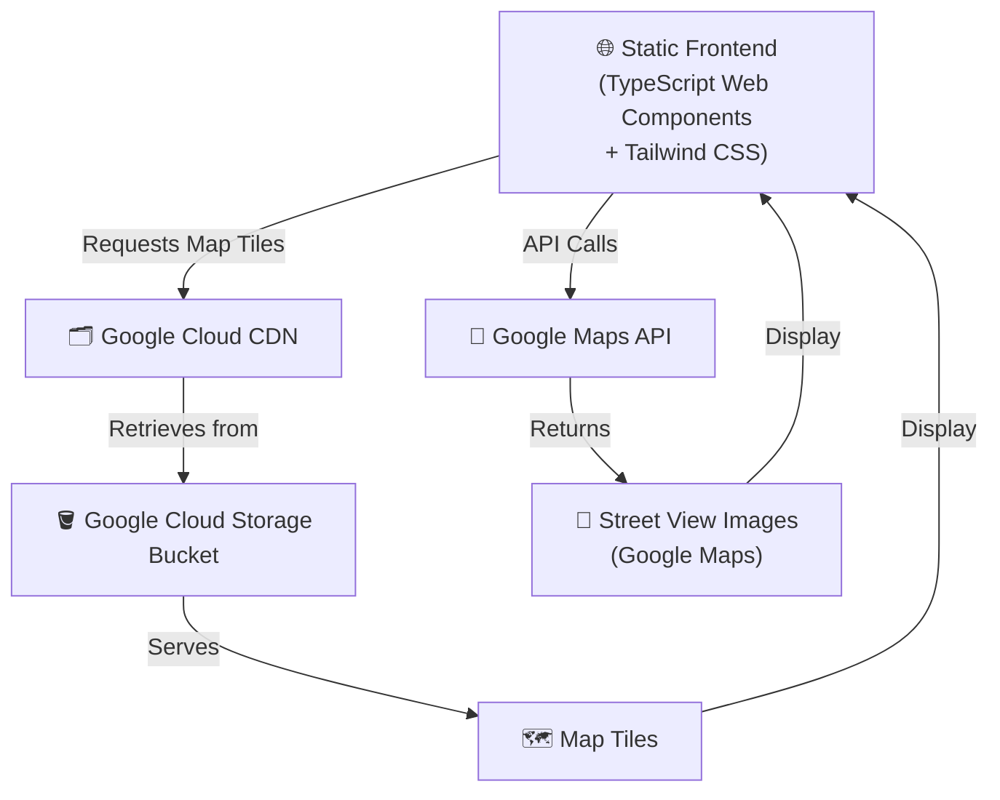

```mermaid
graph TB
    FrontEnd["🌐 Static Frontend<br/>(TypeScript Web Components<br/>+ Tailwind CSS)"]
    GMapsAPI["📍 Google Maps API"]
    CDN["🗂️ Google Cloud CDN"]
    Bucket["🪣 Google Cloud Storage<br/>Bucket"]
    StreetView["📸 Street View Images<br/>(Google Maps)"]
    MapTiles["🗺️ Map Tiles"]
    
    FrontEnd -->|Requests Map Tiles| CDN
    CDN -->|Retrieves from| Bucket
    Bucket -->|Serves| MapTiles
    MapTiles -->|Display| FrontEnd
    FrontEnd -->|API Calls| GMapsAPI
    GMapsAPI -->|Returns| StreetView
    StreetView -->|Display| FrontEnd
```
